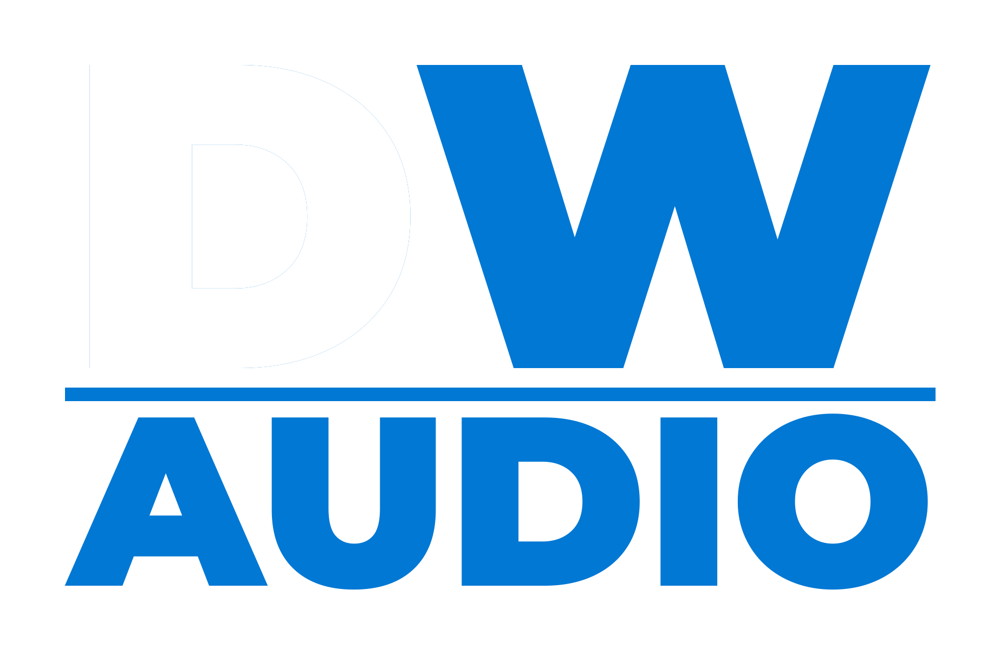

<p align="center">
  
</p>

<h1 align="center">DoneWell Audio</h1>

<p align="center">
  <strong>Real-time acoustic feedback detection for live sound engineers.</strong><br />
  Catches feedback before your audience does.
</p>

<p align="center">
  <a href="https://donewellaudio.com"><strong>Try it now</strong></a> — no install, runs in your browser
</p>

<p align="center">
  
  
  
  
</p>

---

## What It Does

DoneWell Audio listens to your microphone, identifies feedback frequencies using 7 detection algorithms from peer-reviewed acoustic research, and tells you exactly which EQ band to cut — with pitch translation, Q estimation, and severity classification.

It is **analysis-only**. It never outputs or modifies audio. All processing runs locally in your browser.

Built by [Don Wells AV](https://donwellsav.com).

---

## Features

| | Feature | Description |
|---|---|---|
| **7 Algorithms** | MSD, Phase Coherence, Spectral Flatness, Comb Pattern, IHR, PTMR, ML | Each exploits a different physical property of acoustic feedback |
| **6 Gates** | Formant, Chromatic, Comb Stability, Mains Hum, IHR, PTMR | Multiplicative false-positive suppression gates |
| **EQ Advice** | GEQ + PEQ recommendations | ISO 31-band mapping, Q estimation, pitch translation (e.g., A4 +15 cents) |
| **8 Modes** | Speech, Worship, Live Music, Theater, Monitors, Ring Out, Broadcast, Outdoor | Content-aware thresholds tuned for each scenario |
| **Signal Tint** | Whole-console color shift | Gray (idle) → Blue (listening) → Amber (detection) → Red (RUNAWAY) |
| **Ring-Out Wizard** | Guided calibration workflow | Step-by-step EQ notching with running frequency list |
| **Dark/Light** | Full theme switching | Theme-aware canvas rendering, amber sidecar panel design |
| **PWA** | Installable, works offline | Service worker cached via Serwist |
| **ML Pipeline** | ONNX false-positive filter | 929-param MLP trained on labeled spectral snapshots |
| **GDPR** | EU/EEA/UK consent disclosures | Article 6(1)(a) legal basis, jurisdiction tracking |
| **Companion** | Hardware mixer integration | Send EQ cuts to Bitfocus Companion via OSC |
| **Export** | PDF, TXT, CSV, JSON | Calibration reports, session data, spectrum snapshots |

---

## Quick Start

```bash
git clone https://github.com/donwellsav/donewellaudio.git
cd donewellaudio
pnpm install
pnpm dev
```

Open [localhost:3000](http://localhost:3000), grant mic access, click **Start**. That's it.

**Prerequisites:** Node.js 18+, pnpm, modern browser (Chrome 89+, Firefox 76+, Safari 14.1+)

---

## How It Works

```
Mic → GainNode → AnalyserNode (8192 FFT, 50fps)
  ┌─ Main Thread ─────────────────────────────────────────┐
  │  FeedbackDetector.analyze()                           │
  │    Peak detection → MSD → prominence → persistence    │
  │    postMessage(peak, spectrum) [zero-copy transfer]    │
  └───────────────────────────────────────────────────────┘
                          ↓
  ┌─ Web Worker ──────────────────────────────────────────┐
  │  AlgorithmEngine → 7 scores → fuseAlgorithmResults()  │
  │  classifyTrack() → 6 gates → shouldReportIssue()      │
  │  generateEQAdvisory() → postMessage(advisory)         │
  └───────────────────────────────────────────────────────┘
                          ↓
  React render → Canvas spectrum (30fps) + Advisory cards
```

**Key design decision:** The AnalyserNode is passive — DoneWell Audio **never** affects the audio signal.

---

## Tech Stack

| Layer | Technology |
|---|---|
| Framework | Next.js 16 (App Router, Turbopack) |
| Language | TypeScript 5.7 (strict mode, zero `any`) |
| UI | shadcn/ui (New York), Tailwind CSS v4, Radix |
| Audio | Web Audio API (AnalyserNode, 8192-point FFT) |
| DSP | Web Worker (zero-copy Float32Array transfers) |
| Canvas | HTML5 Canvas at 30fps |
| State | React 19 hooks + 4 context providers |
| Testing | Vitest (1326 tests, 97 test files) |
| Errors | Sentry (browser + server + worker) |
| PWA | Serwist (service worker, offline) |
| ML | ONNX Runtime Web (929-param MLP, 4KB) |

No external audio processing libraries. No environment variables required for local dev.

---

## Commands

```bash
pnpm dev              # Dev server on :3000 (Turbopack)
pnpm build            # Production build (generates SW)
pnpm test             # 1322 pass, 4 skip across 97 test files
pnpm lint             # ESLint (flat config, circular dep check)
npx tsc --noEmit      # Type check (run before build)
```

---

## Severity Levels

| Level | Color | What It Means | What To Do |
|---|---|---|---|
| **RUNAWAY** | Red | Feedback growing fast | Cut immediately |
| **GROWING** | Orange | Building, not critical yet | Apply cut soon |
| **RESONANCE** | Yellow | Stable resonant peak | Monitor, cut if it grows |
| **POSSIBLE_RING** | Purple | Subtle ring detected | Watch closely |
| **WHISTLE** | Cyan | Sibilance or whistle | Consider HPF/de-esser |
| **INSTRUMENT** | Green | Likely musical content | Ignore |

---

## Operation Modes

| Mode | Sensitivity | Use Case |
|---|---|---|
| **Speech** | 27 dB | Conferences, lectures |
| **Worship** | 35 dB | Churches, reverberant spaces |
| **Live Music** | 42 dB | Concerts, dense harmonics |
| **Theater** | 28 dB | Drama, musicals, body mics |
| **Monitors** | 15 dB | Stage wedges (fastest) |
| **Ring Out** | 2 dB | System calibration (most sensitive) |
| **Broadcast** | 22 dB | Studios, podcasts |
| **Outdoor** | 38 dB | Festivals, wind-resistant |

---

<details>
<summary><strong>Detection Algorithms (technical details)</strong></summary>

### 1. MSD (Magnitude Slope Deviation) — DAFx-16

Feedback amplitude grows exponentially → linear in dB. The second derivative of dB magnitude over time is near-zero for feedback.

```
MSD(k,m) = Σ |G''(k,n)|²  for n = (m-N)+1 to m
```

| Content | Accuracy | Frames Needed |
|---------|----------|---------------|
| Speech | 100% | 7 (~160ms) |
| Classical | 100% | 13 (~300ms) |
| Rock | 22% | 50+ (needs compression detection) |

### 2. Phase Coherence — KU Leuven 2025

Feedback maintains constant phase across frames. Music does not.

```
φ_coherence(k) = |1/N Σ e^(jΔφ(k,n))|
```

### 3. Spectral Flatness — Glasberg-Moore

Pure tones have near-zero Wiener entropy. Also detects compression via crest factor and dynamic range analysis.

```
SF = (∏ X(k))^(1/N) / (1/N Σ X(k))
```

### 4. Comb Pattern Detection — DBX

Multiple feedback frequencies appear at regular intervals due to acoustic path delay:

```
f_n = n·c / 2d    (c = 343 m/s, d = path length)
```

Temporal stability tracking distinguishes static feedback loops from sweeping effects (flanger, phaser).

### 5. IHR (Inter-Harmonic Ratio)

Feedback = clean tone (low IHR). Music = rich harmonics (high IHR). Measures ratio of harmonically-related energy to unrelated spectral energy.

### 6. PTMR (Peak-to-Median Ratio)

Feedback peaks are narrow (PTMR > 15 dB). Music is broad (PTMR < 10 dB). Compares peak amplitude to local neighborhood median.

### 7. ML (ONNX Runtime Web)

Bootstrap MLP (11→32→16→1, 929 params, 4KB) trained on labeled spectral snapshots. Encodes existing gate logic as a neural network. Lazy-loaded in worker.

### Fusion Weights

| Content | MSD | Phase | Spectral | Comb | IHR | PTMR | ML |
|---------|-----|-------|----------|------|-----|------|-----|
| Default | 0.27 | 0.23 | 0.11 | 0.07 | 0.12 | 0.10 | 0.10 |
| Speech | 0.30 | 0.22 | 0.09 | 0.04 | 0.09 | 0.16 | 0.10 |
| Music | 0.07 | 0.32 | 0.09 | 0.07 | 0.22 | 0.13 | 0.10 |
| Compressed | 0.11 | 0.27 | 0.16 | 0.07 | 0.16 | 0.13 | 0.10 |

### Multiplicative Gates

| Gate | Trigger | Effect |
|------|---------|--------|
| IHR gate | ≥3 harmonics + IHR > 0.35 | probability × 0.65 |
| PTMR gate | PTMR score < 0.2 | probability × 0.80 |
| Formant gate | 2+ vocal formant bands + Q 3–20 | probability × 0.65 |
| Chromatic gate | On 12-TET grid ±5 cents + coherence > 0.80 | phase × 0.60 |
| Comb stability | Spacing CV > 0.05 over 16 frames | comb × 0.25 |
| Mains hum | On 50n/60n Hz + 2 corroborating peaks | probability × 0.40 |

</details>

---

<details>
<summary><strong>Project Structure</strong></summary>

```
app/
├── layout.tsx                        # Root layout
├── page.tsx                          # Entry → AudioAnalyzerClient
├── api/v1/ingest/route.ts            # Spectral snapshot ingest (rate-limited)
└── api/geo/route.ts                  # GDPR geo detection

components/
├── analyzer/                         # Analyzer product UI
│   ├── AudioAnalyzer.tsx             # Root orchestrator
│   ├── HeaderBar.tsx                 # Header (useSignalTint)
│   ├── IssueCard.tsx                 # Advisory card + swipe gestures
│   ├── SpectrumCanvas.tsx            # RTA canvas
│   ├── RingOutWizard.tsx             # Guided calibration
│   ├── settings/                     # 4 tabs: Live, Setup, Display, Advanced
│   └── help/                         # 6 tabs: Guide, Modes, Algorithms, Reference, Companion, About
└── ui/                               # shadcn/ui primitives

hooks/                                # Custom hooks
├── useSignalTint.ts                  # Severity → CSS vars
├── useDSPWorker.ts                   # Worker lifecycle
├── useSwipeGesture.ts                # Touch gestures
└── useLayeredSettings.ts             # Settings composition

lib/dsp/                              # DSP modules
├── feedbackDetector.ts               # Core peak detection (1527L)
├── fusionEngine.ts                   # Algorithm fusion + MINDS
├── combPattern.ts                    # Comb filter + stability
├── spectralAlgorithms.ts             # IHR, PTMR, content type
├── classifier.ts                     # 11-feature Bayesian classification
├── constants/                        # 6 domain-specific constant files
└── mlInference.ts                    # ONNX model inference

contexts/                             # React context providers
tests/                                # Integration and DSP regression tests
```

</details>

---

<details>
<summary><strong>Mathematical Foundations</strong></summary>

### Quadratic Interpolation
```
δ = 0.5 × (α - γ) / (α - 2β + γ)
true_freq = (peak_bin + δ) × sample_rate / fft_size
```

### Adaptive Noise Floor (EMA)
```
attack: noise_floor += (level - noise_floor) × α_attack    (200ms tau)
release: noise_floor += (level - noise_floor) × α_release   (1000ms tau)
```

### A-Weighting (IEC 61672-1)
```
R_A(f) = 12194² × f⁴ / ((f² + 20.6²) × √((f² + 107.7²)(f² + 737.9²)) × (f² + 12194²))
```

### Schroeder Frequency
```
f_S = 2000 × √(RT60 / Volume)
```

### Q Factor
```
Q = f_center / bandwidth_3dB
```

</details>

---

<details>
<summary><strong>Mic Calibration Profiles</strong></summary>

| Profile | Points | Key Deviations |
|---------|--------|----------------|
| Behringer ECM8000 (CSL #746) | 38 | +4.7 dB @ 16 kHz, +3.4 dB @ 12.5 kHz |
| dbx RTA-M | 31 | Near-flat, ±1.5 dB |
| Smartphone MEMS | 31 | −12 dB @ 20 Hz, +3.8 dB @ 8–10 kHz |

Compensation = inverse of measured response, interpolated in log-frequency space, applied per FFT bin alongside A-weighting.

</details>

---

<details>
<summary><strong>Development Guide</strong></summary>

### Adding a New Algorithm

1. Define types in `lib/dsp/fusionEngine.ts` (add to `AlgorithmScores` interface)
2. Implement the algorithm in a new file under `lib/dsp/`
3. Add to barrel re-export in `lib/dsp/advancedDetection.ts`
4. Integrate in `dspWorker.ts` (score computation) and `fusionEngine.ts` (weights)
5. Add UI toggle in `settings/AdvancedTab.tsx`
6. Update `help/` tabs and this README

### Modifying Detection Thresholds

All tuning constants are in `lib/dsp/constants/`:

| File | Contents |
|------|----------|
| `musicConstants.ts` | ISO bands, pitch reference, EXP_LUT |
| `acousticConstants.ts` | Schroeder, frequency bands, room estimation |
| `calibrationConstants.ts` | A-weighting, mic profiles |
| `detectionConstants.ts` | MSD, persistence, severity, gates, algorithm settings |
| `presetConstants.ts` | 8 operation modes, DEFAULT_SETTINGS, room presets |
| `uiConstants.ts` | Canvas, colors, EQ presets, mobile settings |

</details>

---

## Academic References

1. **DAFx-16** — "Automatic Detection of Acoustic Feedback Using Magnitude Slope Deviation"
2. **DBX** — "Feedback Prevention and Suppression" (comb filter detection)
3. **KU Leuven 2025** — "2-ch Acoustic Feedback Cancellation System" (phase coherence)
4. **Carl Hopkins** — *Sound Insulation* (2007) — Schroeder frequency, modal density
5. **Glasberg & Moore** (1990) — ERB bandwidth model
6. **IEC 61672-1** — A-frequency-weighting standard

---

## Browser Support

| Browser | Version | Status |
|---------|---------|--------|
| Chrome / Edge | 89+ | Full support (recommended) |
| Firefox | 76+ | Full support |
| Safari | 14.1+ | Supported (different mic permission flow) |

HTTPS or `localhost` required for microphone access.

---

## License

Copyright 2024-2026 Don Wells AV. All rights reserved.
